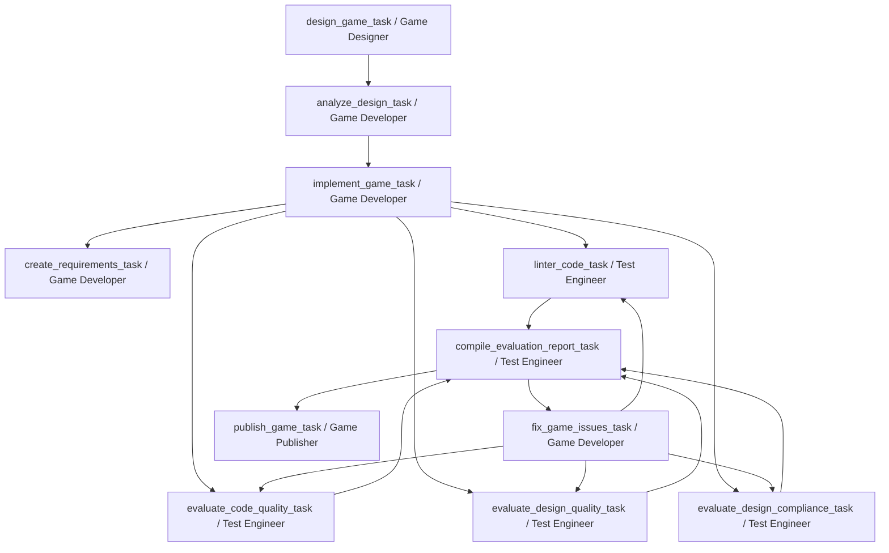
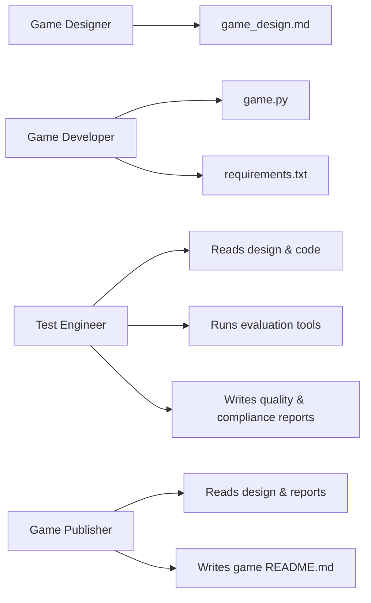

# AgentForce Interactive – Multi‑Agent Game Studio

AgentForce Interactive is a multi‑agent game studio built using [CrewAI](https://crewai.com). Given a game concept, a crew of agents:

- Designs the game.
- Implements a playable `game.py` using Pygame.
- Generates requirements and multiple quality reports.
- Optionally iterates to fix issues before publishing a final README for the game.

All generated artifacts live under `games/{game_name}/`.

---

## 1. Architecture Overview

### 1.1 High‑Level Flow

The end‑to‑end pipeline for a single game:



Internally, `run()` wraps this flow with a feedback loop:

1. Design → Analyze → Implement → Requirements → Evaluation tasks.
2. If evaluation reports or `game.py` show issues (JSON, formatting, design mismatches), run `fix_game_issues_task` and re‑evaluate.
3. Once issues are resolved (or max fix attempts reached), run `publish_game_task` to generate the final per‑game `README.md`.

### 1.2 Agents and Tools

Agents are defined in `src/agentforce_interactive/config/agents.yaml` and wired in `src/agentforce_interactive/crew.py`.



**Game Designer (`game_designer`)**
- Goal: Create `game_design.md` (single‑file `game.py` design using shapes/pygame).
- Tools: none (writes design from prompt + concept).

**Game Developer (`game_developer`)**
- Goal: Implement and fix `game.py`, and create `requirements.txt`.
- Tools:
  - `ReadGameDesignTool` – reads `games/{game_name}/game_design.md`.
  - `ReadGameCodeTool` – reads `games/{game_name}/game.py`.
  - `ReadEvaluationReportTool` – reads `evaluation_report.md` when fixing issues.

**Test Engineer (`test_engineer`)**
- Goal: Evaluate code quality, design doc quality, and design compliance.
- Tools:
  - `ReadGameDesignTool` – design doc.
  - `ReadGameCodeTool` – implementation.
  - `CodeQualityEvaluatorTool` – checks `game.py` for JSON/markdown/explanatory text and syntax.
  - `DesignQualityEvaluatorTool` – checks `game_design.md` formatting.
  - `DesignComplianceEvaluatorTool` – compares design vs implementation.
  - `ReadReportFileTool` – reads intermediate reports for the compiled evaluation.

**Game Publisher (`game_publisher`)**
- Goal: Produce a user‑facing `README.md` for the game.
- Tools: none (uses context from prior tasks).

All agents use the same LLM backend configured in `pyproject.toml`:

- Provider: `openai`
- Model: `gpt-5.1`
- Temperature: `0.1`

---

## 2. Generated Files and Project Layout

For each game, the crew works under `games/{game_name}/`. After a successful run, you should see something like:

- `game_design.md` – Detailed design document.
- `design_analysis.md` – Optional analysis/summary of the design.
- `game.py` – The complete, self‑contained Pygame implementation.
- `requirements.txt` – External dependencies (e.g. `pygame==2.5.2`).
- `linter_report.md` – Syntax and linter‑style checks for `game.py`.
- `code_quality_report.md` – Checks for JSON/markdown/LLM artifacts in `game.py`.
- `design_quality_report.md` – Checks design doc formatting (markdown‑only).
- `compliance_report.md` – Checks that `game.py` matches `game_design.md`.
- `evaluation_report.md` – Compiled high‑level evaluation from the above reports.
- `README.md` – Game‑specific README produced by `publish_game_task`.

Older runs may also contain:

- `test_game.py`, `test_output.txt`, `test_report.md` – Legacy unittest artifacts from earlier iterations. They are not part of the current automated pipeline, but you can still run them manually if present.

At the project root:

- `pyproject.toml` – Project metadata + CrewAI LLM config (OpenAI gpt‑5.1, temperature 0.1).
- `src/agentforce_interactive` – Crew wiring, main entrypoints, tools, config YAMLs.
- `games/` – All generated game folders.

---

## 3. Setup and Environment

### 3.1 Requirements

- Python `>= 3.10, < 3.14`.
- [UV](https://docs.astral.sh/uv/) (recommended) or plain `pip` + virtualenv.

Install UV (once):

```bash
pip install uv
```

Install project dependencies (from repo root):

```bash
uv sync
```

or, using CrewAI’s helper:

```bash
crewai install
```

### 3.2 Environment Variables and `.env`

CrewAI will read environment variables (and a `.env` file if present). For this project you’ll typically want:

- Required (for LLM access):
  - `OPENAI_API_KEY` – your OpenAI API key used by CrewAI when `provider = "openai"`.

- Optional (for controlling game generation):
  - `GAME_CONCEPT` – default concept text used by `run()` if not provided via CLI.
  - `GAME_NAME` – default folder name (will be sanitized to `games/{game_name}/`).

- Optional (CrewAI tracing):
  - `CREWAI_TRACING_ENABLED=true` – enable CrewAI tracing if you want richer logs.

Example `.env`:

```env
OPENAI_API_KEY=sk-...
CREWAI_TRACING_ENABLED=true

# Optional defaults
GAME_CONCEPT=A simple Snake game where the player controls a snake to eat food and grow longer
GAME_NAME=snake_game
```

---

## 4. Running the Project

You can run the crew either through the CrewAI CLI (`crewai run`) or directly via Python. The recommended way to avoid some CLI quirks is direct Python execution (see known issue below).

### 4.1 Using CrewAI CLI (interactive)

From the repo root:

```bash
crewai run
```

You’ll be prompted for:

- Game concept (e.g., “A simple Snake game where the player controls a snake…”).
- Game name (used as `{game_name}` for `games/{game_name}/`).

### 4.2 Using CrewAI CLI with env vars

```bash
GAME_CONCEPT="A Pong game with two paddles and a bouncing ball" crewai run
```

With custom name:

```bash
GAME_CONCEPT="A Pong game with two paddles and a bouncing ball" \
GAME_NAME="pong_game" \
crewai run
```

### 4.3 Direct Python execution (recommended for stability)

From the repo root:

```bash
cd src
python -m agentforce_interactive.main "A Pong game with two paddles and a bouncing ball"
```

With explicit game name:

```bash
cd src
python -m agentforce_interactive.main \
  "A simple Snake game where the player controls a snake to eat food and grow longer" \
  "snake_game"
```

You can also rely on environment variables:

```bash
cd src
GAME_CONCEPT="A Snake game..." GAME_NAME="snake_game" python -m agentforce_interactive.main
```

On success, you should see:

- `Game successfully created at: games/{game_name}/game.py`
- `Game directory: games/{game_name}`

The directory will contain all game artifacts described earlier.

---

## 5. Known Issue: Rich + CrewAI CLI RecursionError

When running via the CrewAI CLI wrapper (for example, `uv run run_crew` or some `crewai` commands), you may occasionally see an error after the crew finishes:

- Stack trace shows `rich.file_proxy.FileProxy.__getattr__` repeated many times.
- Ends with `RecursionError: maximum recursion depth exceeded`.
- UV or the shell reports a non‑zero exit status even though the game was created.

This is a bug in the Rich + CrewAI CLI “file proxy” layer, not in this project’s logic.

Important notes:

- In these cases the game is usually **successfully created** – check:
  - `games/{game_name}/game.py` exists and is non‑empty.
- The error happens when the CLI tries to `print()` the final “Game successfully created at …” message through Rich’s `FileProxy`.

How to deal with it:

- For now, treat this specific `FileProxy` recursion stack trace as cosmetic if your `game.py` exists.
- Prefer running via direct Python (`python -m agentforce_interactive.main`) instead of the CLI wrapper if you want to avoid it entirely.
- If desired, update your virtualenv’s `rich` and `crewai` versions to pick up upstream fixes when they become available.

---

## 6. Customizing the Crew

You can customize behavior without touching the core flow:

- `src/agentforce_interactive/config/agents.yaml`  
  - Adjust agent roles, goals, backstories, and per‑agent LLMs.
- `src/agentforce_interactive/config/tasks.yaml`  
  - Change task descriptions, validation checklists, and expected outputs.
- `src/agentforce_interactive/crew.py`  
  - Wire different tools to agents or alter task context dependencies.
- `src/agentforce_interactive/main.py`  
  - Change how the crew is kicked off, feedback loop parameters, or how inputs are gathered.

The current configuration is tuned to:

- Keep `game.py` clean (no JSON/markdown/LLM artifacts).
- Enforce a single‑file Pygame implementation per game.
- Use multiple evaluation passes and targeted fixes to reduce bugs before publishing.
